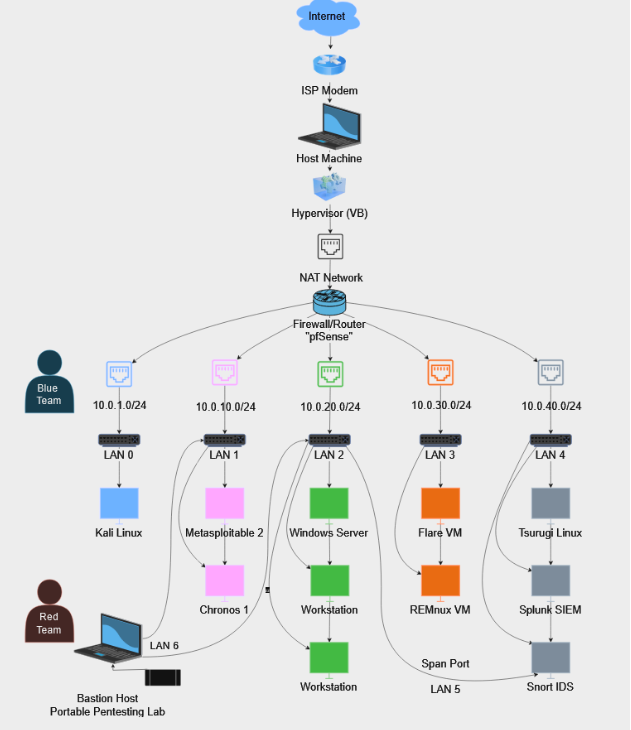

# Network Security Virtualized Architecture

## Project Overview

This repository contains documentation and resources for a comprehensive network security project developed as a final year thesis for a Network and Telecommunications degree. The project demonstrates a virtualized network architecture with various security components, implemented using Oracle VirtualBox.

**Note: This repository is still under development. Installation guides and additional resources will be added in the near future.**

## Authors

- [Alaa Eddine Ayedi](https://github.com/nattyCoder)
- [Ranim Hassine](https://github.com/ranimhassine)

## Network Topology

The image above illustrates the complete network topology of our virtualized security architecture. It shows the relationship between different components, including:

- Internet connection through ISP Modem
- Host Machine running the Hypervisor (VirtualBox)
- NAT Network
- pfSense Firewall/Router
- Five separate subnets (10.0.1.0/24 to 10.0.40.0/24)
- Various virtual machines in each subnet
- Blue Team and Red Team interaction points

## Project Components

### 1. Network Architecture

The project implements a virtualized network architecture with the following components:

- Central Node: pfSense VM (Firewall and Router)
- 5 Subnets, each hosting specific services:
  1. LAN 0 (10.0.1.0/24): Kali Linux (Attack Machine)
  2. LAN 1 (10.0.10.0/24): Vulnerable Machines (Metasploitable 2, Chronos 1)
  3. LAN 2 (10.0.20.0/24): Active Directory (Windows Server, Workstations)
  4. LAN 3 (10.0.30.0/24): Malware Analysis (Flare VM, REMnux VM)
  5. LAN 4 (10.0.40.0/24): Security Tools (Tsurugi Linux, Splunk SIEM, Snort IDS)
- LAN 5: Span Port for network traffic monitoring
- Bastion Host: Portable Pentesting Lab for Red Team operations

### 2. Virtual Machines

The following virtual machines are part of the architecture:

- [pfSense](https://www.pfsense.org/) (Firewall and Router)
- [Kali Linux](https://www.kali.org/) (Attack Machine)
- [Metasploitable 2](https://sourceforge.net/projects/metasploitable/) (Vulnerable Machine)
- [Chronos 1](https://sourceforge.net/projects/chronos/) (Vulnerable Machine)
- [Windows Server](https://www.microsoft.com/en-us/evalcenter/evaluate-windows-server-2019) (Active Directory)
- [Windows 10 Workstations](https://www.microsoft.com/en-us/software-download/windows10)
- [FLARE VM](https://github.com/mandiant/flare-vm) (Malware Analysis)
- [REMnux](https://remnux.org/) (Malware Analysis)
- [Tsurugi Linux](https://tsurugi-linux.org/) (DFIR)
- [Splunk](https://www.splunk.com/) (SIEM)
- [Snort](https://www.snort.org/) (IDS)
- Custom Ubuntu-based Portable Pentesting Lab (Bastion Host)

### 3. Security Scenarios

The project includes both offensive and defensive security scenarios:

- Penetration testing against Active Directory and vulnerable machines
- Malware analysis using specialized VMs
- Network traffic monitoring and intrusion detection
- Security information and event management (SIEM)
- Digital forensics and incident response (DFIR)

## Documentation

- [Project Thesis](./thesis.pdf) (PDF placeholder)

## Installation Guides (Coming Soon)

- pfSense Setup
- Kali Linux Configuration
- Windows Server and Active Directory Setup
- Windows 10 Workstation Configuration
- Metasploitable 2 and Chronos 1 Installation
- FLARE VM and REMnux Setup
- Splunk Installation and Configuration
- Snort IDS Setup and Rules Configuration
- Tsurugi Linux Installation
- Custom Ubuntu Pentesting Lab Creation

## Contributing

This project is currently maintained by the original authors. However, we welcome contributions, suggestions, and issue reports. Please feel free to open an issue or submit a pull request.

## Acknowledgments

- [Oracle VirtualBox](https://www.virtualbox.org/) for providing the virtualization platform
- All open-source tools and operating systems used in this project
- Our academic institution for supporting this research
